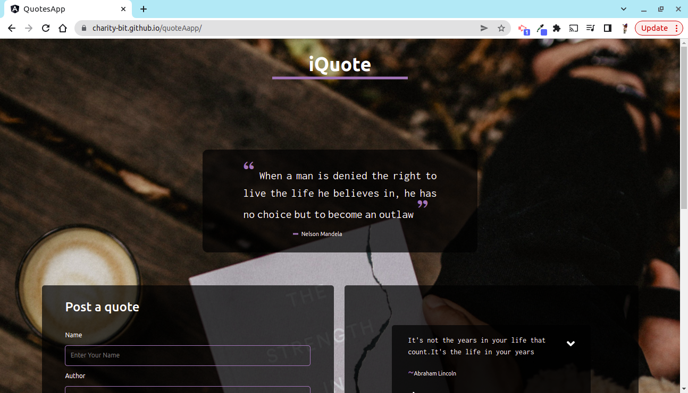
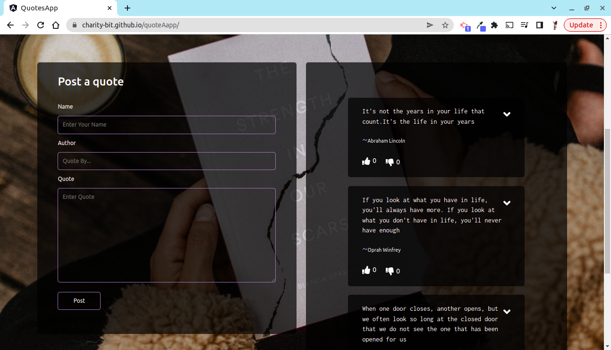

# QuotesApp

This is an application that allows users to post the quotes that inspire them and have them voted.

Click to view <a href="https://charity-bit.github.io/quoteAapp/">live Demo</a>

## Table of Content

- [Description](#description)
- [Installation Requirement](#Installation)
- [Technology Used](#technology-used)
- [Reference](#reference)
- [Licence](#licence)
- [Authors Info](#author-Info)
- [ToDO](#To-Do)

## Description

 This is an application that allows users to post the quotes that inspire them and have them voted.

## Installation

### Requirements

- Devices such as tablet , phones , laptops and desktop computers.

- Access to the internet.

### Installation Process

---

Click on the link below to view the live site

<a href="https://charity-bit.github.io/quoteAapp/">https://charity-bit.github.io/quoteAapp/<a>

---

git clone - to clone this repo

## Technology Used

- ANGULAR

- CSS 

- TYPESCRIPT.

## Reference

- <a href="https://developer.mozilla.org/en-US/"> MDN Web Docs</a>
<a href="https://angular.io/">Angular official documentation</a>

## Licence
MIT License

Copyright (c) 2022 Nyanchera

Permission is hereby granted, free of charge, to any person obtaining a copy
of this software and associated documentation files (the "Software"), to deal
in the Software without restriction, including without limitation the rights
to use, copy, modify, merge, publish, distribute, sublicense, and/or sell
copies of the Software, and to permit persons to whom the Software is
furnished to do so, subject to the following conditions:

The above copyright notice and this permission notice shall be included in all
copies or substantial portions of the Software.

THE SOFTWARE IS PROVIDED "AS IS", WITHOUT WARRANTY OF ANY KIND, EXPRESS OR
IMPLIED, INCLUDING BUT NOT LIMITED TO THE WARRANTIES OF MERCHANTABILITY,
FITNESS FOR A PARTICULAR PURPOSE AND NONINFRINGEMENT. IN NO EVENT SHALL THE
AUTHORS OR COPYRIGHT HOLDERS BE LIABLE FOR ANY CLAIM, DAMAGES OR OTHER
LIABILITY, WHETHER IN AN ACTION OF CONTRACT, TORT OR OTHERWISE, ARISING FROM,
OUT OF OR IN CONNECTION WITH THE SOFTWARE OR THE USE OR OTHER DEALINGS IN THE
SOFTWARE.

 

 [Go Back to the top](#QuotesApp)

## Authors Info

LinkedIn - [Charity Nyanchera](https://www.linkedin.com/in/charity-nyanchera-2679281a2/)

twitter - [Twitter](https://twitter.com/CcNyanchera)

[Go Back to the top](QuotesApp)
  
 

